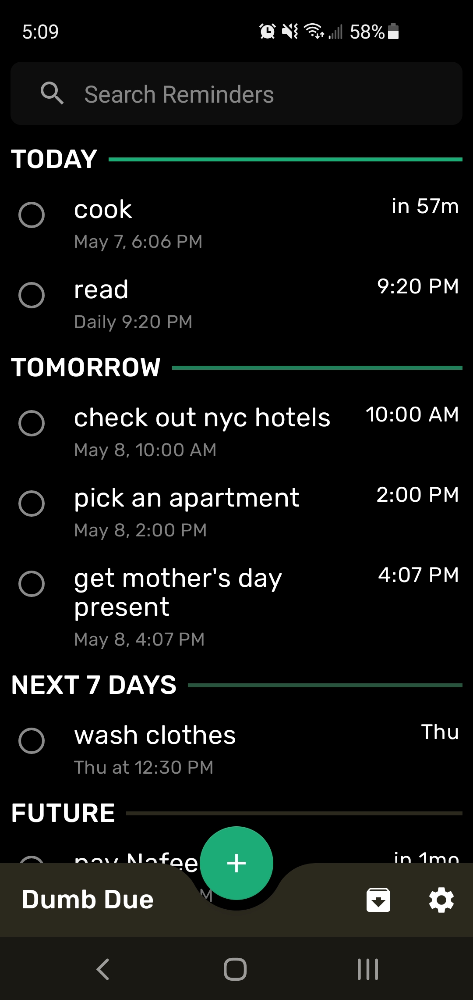
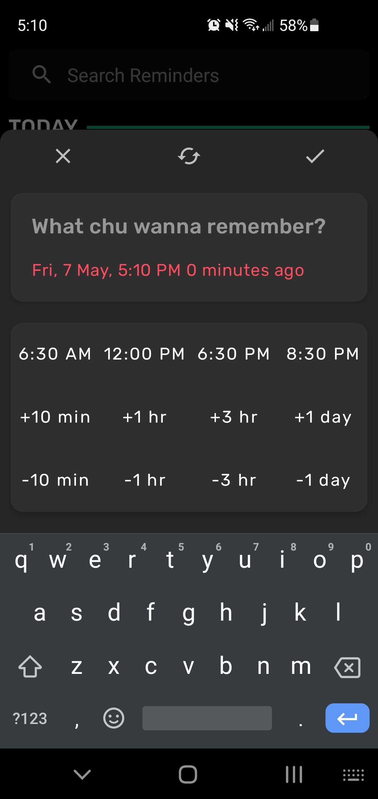
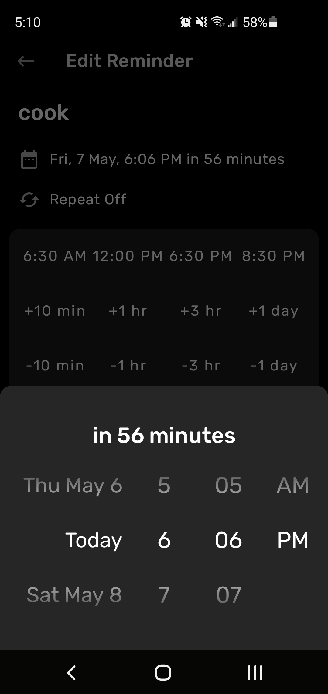
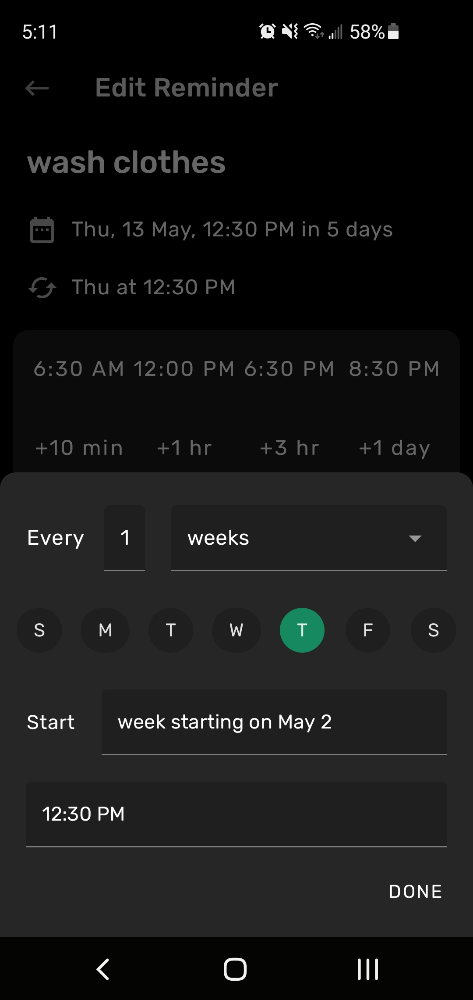

# DumbDue

A dumber version of Due for iOS, for Android.

Built with Kotlin using ViewModels, Navigation, Room, LiveData, and Databinding from Architecture Components and Hilt for very basic Dependency Injection.

Development has been put on hold (maybe forever idk).

# Screenshots
## Home Screen

  

## Add reminder screen

  

**with customizable quick access time setters**

## Date/Time Scroller

  

**in case the user wants something more granular than the quick access time setters or to flick to a date/time**

## Repeat Interval Screen

  

**with repeat intervals that support basically every possible kind. Eg: second and fourth friday of every month, the 1st of every month, weekdays, every other day, every fourth of july, etc.**
